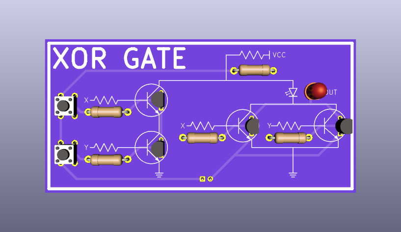

# xor-gate

This project was my first KiCad learning experience. It was inspired by [HackerBox 0039](https://www.instructables.com/HackerBox-0039-Level-Up/), which includes similar PCBs for other gates such as AND, NAND, OR and NOR. I thought a similar XOR board would be nice.

## Materials required

You will obviously need the board, which you can have manufactured using the PCB design in this project. Additionally, you will need the following:

* Four (4) 2N2222A NPN Transistors (TO-92 Package)
* Four (4) 10kk Ohm Resistors
* One (1) 1K Ohm Resistor
* One (1) 5mm LED
* Two (2) Tactile Momentary Buttons
* One (1) 2x1 Pin Header

## Assembly

The 1k Ohm resistor goes in the top of the board by VCC. Orientation doesn't matter.

The 10k Ohm resistors go in the other resistor positions. Orientation doesn't matter.

The transistors are all oriented with the flat side to the right.

LED is oriented with the short pin down (towards ground).

The buttons should only fit in one direction.

## Caveat

The board works, but this is not necessarily the best TTL XOR design, since I am not an electrical engineer.
